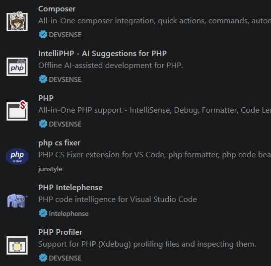

# PRÁCTICA GUIADA 01:  CONFIGURACIÓN DE VS CODE PARA DESARROLLO EN PHP

## PASO 1: LOCALIZACIÓN DEL BINARIO DE PHP (10 MIN)

Antes de configurar el editor, debes conocer la ruta exacta donde está instalado el ejecutable de PHP en tu sistema operativo.

1. Abre la terminal de tu sistema y ejecuta:

  **En Linux / macOS:**
  ```bash
  which php
  ```
  **En Windows (CMD / PowerShell):**
  ```cmd
  where php
  ```

/// admonition | Ruta habitual
    type: hint

La ruta habitual en nuestro caso, ya que usamos Lerd/Herd con la versión 8.4 de PHP, es `C:\Users\usuario\.config\herd\bin\php84\php.exe`, donde `usuario` es tu nombre de usuario de Windows. 
///


2. **`[LIBRETA]`** Anota en tu cuaderno de clase la ruta exacta que te ha devuelto la terminal.

---

## 4. PASO 2: EXTENSIONES IMPRESCINDIBLES (20 MIN)

Abre la pestaña de extensiones en VS Code (`Ctrl + Shift + X` o `Cmd + Shift + X`) e instala las siguientes extensiones:

1. **PHP Intelephense** *(por Ben Mewburn)*: 
  *Función:* El motor de Inteligencia de Código más potente para PHP. Proporciona autocompletado, navegación a definiciones (`F12`), verificación de tipos y detección de errores sintácticos en tiempo real.

2. **PHP Debug** *(por Xdebug)*:
  *Función:* Permite pausar la ejecución del código con puntos de interrupción (*breakpoints*) para inspeccionar variables.

3. **PHP CS Fixer** *(por junstyle)*:
  *Función:* Formatea el código PHP automáticamente según los estándares internacionales de codificación (**PSR-12**).

4. **PHP** *(por devsense)*:
  *Función:* Proporciona una serie de herramientas para PHP.

Una vez instaladas, verifica que aparecen en la lista de extensiones:



---

## 5. PASO 3: CONFIGURACIÓN DE `settings.json` (15 MIN)

Accede a la configuración avanzada de VS Code presionado `Ctrl + Shift + P` (o `Cmd + Shift + P`), escribe **`Preferences: Open User Settings (JSON)`** y pulsa Enter.

Añade las siguientes claves de configuración en tu archivo `settings.json`:

```json
{
  // 1. Ruta al ejecutable de PHP para validación de errores
  "php.validate.executablePath": "Users/usuario/.config/herd/bin/php84/php.exe",

  // 2. Desactivar el autocompletado nativo básico para evitar duplicados con Intelephense
  "php.suggest.basic": false,

  // 3. Configuración específica para archivos PHP
  "[php]": {
    "editor.defaultFormatter": "bmewburn.vscode-intelephense-client",
    "editor.formatOnSave": true,
    "editor.tabSize": 4,
    "editor.insertSpaces": true
  },

  // 4. Versión objetivo de PHP para Intelephense
  "intelephense.environment.phpVersion": "8.4",

  // 5. Configuración de formateo PSR-12
  "php-cs-fixer.rules": "@PSR12"
}

```

/// admonition | **Atención:**
    type: attention
    
Reemplaza la ruta de la primera línea por la ruta real anotada en el Paso 1.
///
